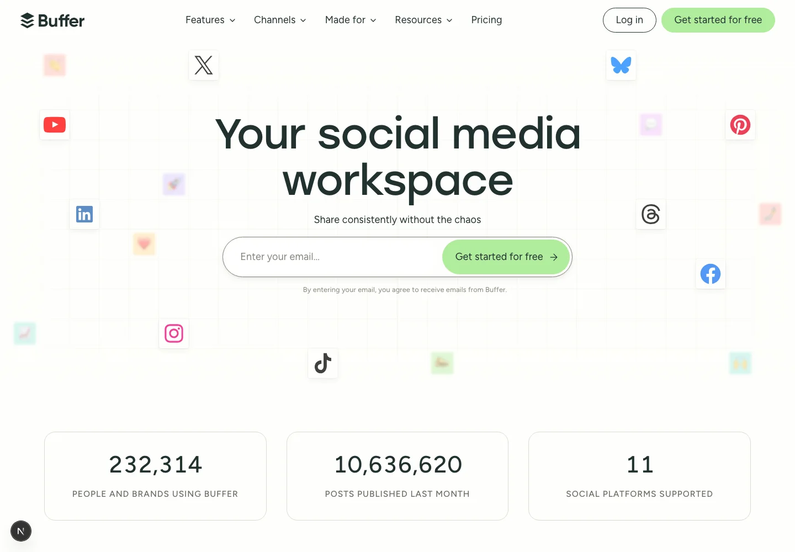
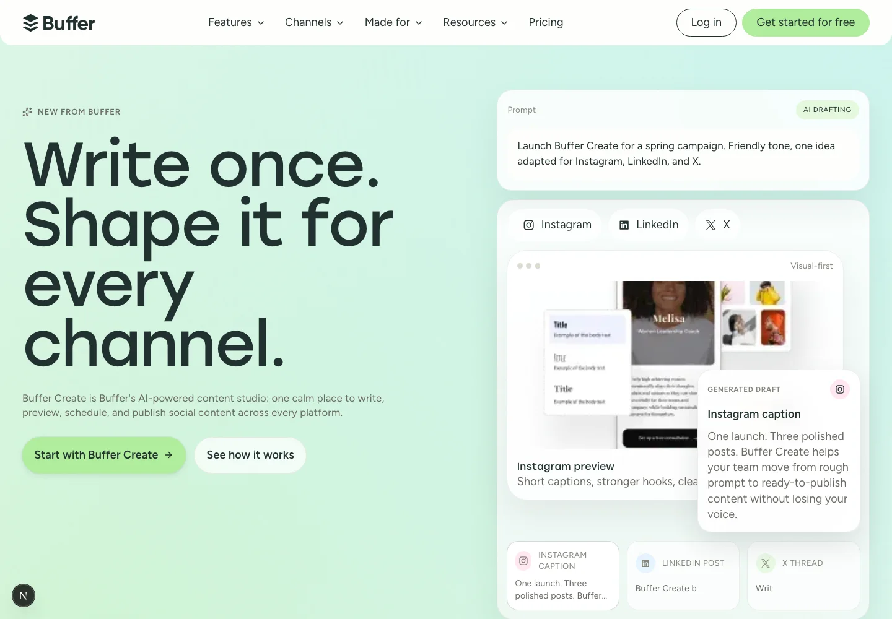
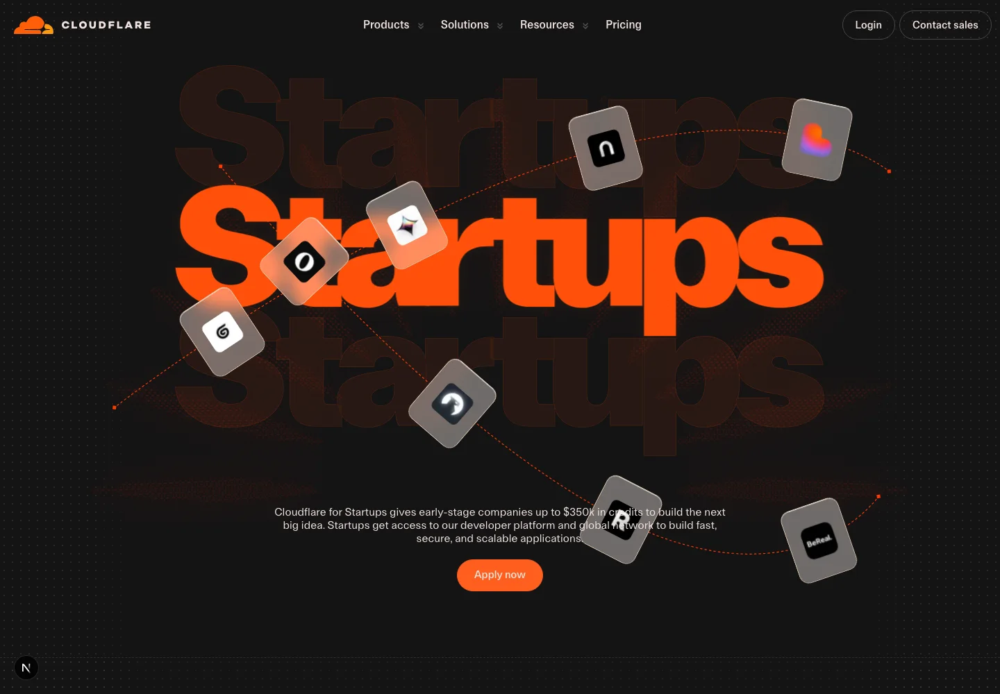
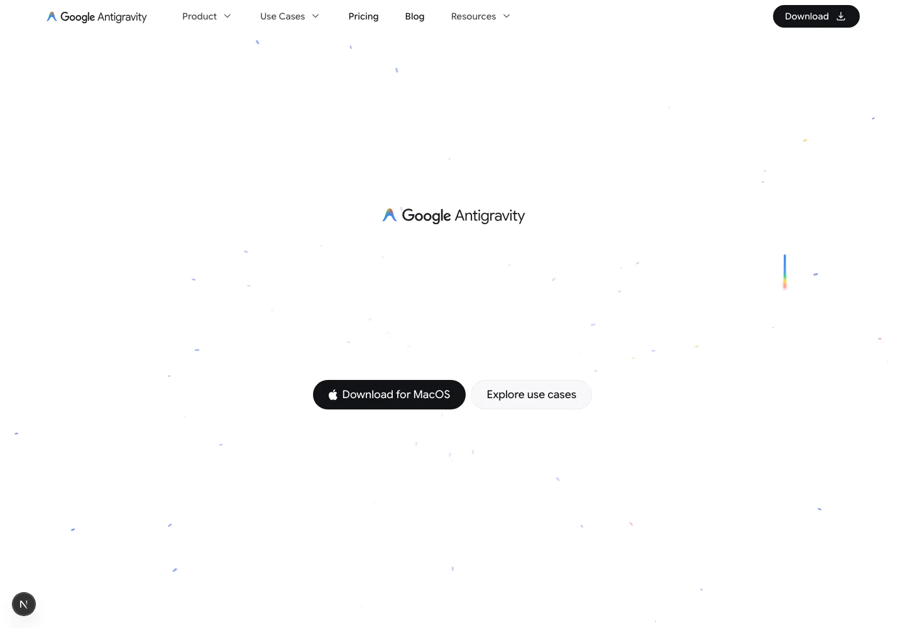

# 🚀 Landing Page Collection

A Next.js 16 visual lab for high-fidelity landing-page clones and polished product-launch experiments. Each route is built as a real page, with local assets, route-scoped components, responsive behavior, motion, and validation, so the repo can keep growing as a serious collection instead of becoming a one-off demo.

The project is intentionally experimental: clone the look closely, rebuild it cleanly, verify it locally, then keep improving the page with better screenshots, assets, interactions, and documentation.

## Pages

| Route | What it is | Notes |
| --- | --- | --- |
| `/buffer` | Buffer homepage clone | Buffer-style homepage with header/footer, hero motion, audience tabs, social proof, local image assets, and imported Buffer CSS references. |
| `/create-studio` | Buffer Create launch page | Fictional Buffer AI content studio with animated platform previews, scheduling, analytics, brand-kit, pricing, and CTA sections. |
| `/cloudflare-startups` | Cloudflare Startups clone | Dark Cloudflare-style startup program page with hero orbit visuals, dropdown nav, mobile drilldown menu, tiers, FAQ, CTA, and footer. |
| `/antigravity-home` | Antigravity experiment | Cinematic landing page with scroll video, particle atmosphere, rail UI, and high-motion product storytelling. |

The root `/` route is intentionally unused for now. Every page lives on an explicit route so the collection can expand cleanly.

## Preview Grid

These are current desktop preview crops from the local app. Each image links to the matching full-page screenshot captured after scrolling through the page first, so below-the-fold reveal animations are included in the final long capture.

| Buffer | Buffer Create |
| --- | --- |
| [](public/images/readme/buffer-desktop-full.webp) | [](public/images/readme/create-studio-desktop-full.webp) |
| `/buffer` | `/create-studio` |

| Cloudflare Startups | Antigravity Home |
| --- | --- |
| [](public/images/readme/cloudflare-startups-desktop-full.webp) | [](public/images/readme/antigravity-home-desktop-full.webp) |
| `/cloudflare-startups` | `/antigravity-home` |

## Full-Page Screenshots

The long screenshots are optimized WebP files stored in `public/images/readme/`.

| Route | Full capture |
| --- | --- |
| `/buffer` | `1440x7993` - [buffer-desktop-full.webp](public/images/readme/buffer-desktop-full.webp) |
| `/create-studio` | `1440x8827` - [create-studio-desktop-full.webp](public/images/readme/create-studio-desktop-full.webp) |
| `/cloudflare-startups` | `1440x6278` - [cloudflare-startups-desktop-full.webp](public/images/readme/cloudflare-startups-desktop-full.webp) |
| `/antigravity-home` | `1440x9477` - [antigravity-home-desktop-full.webp](public/images/readme/antigravity-home-desktop-full.webp) |

## Stack

- Next.js `16.2.4` with the App Router
- React `19.2.4`
- TypeScript `5`
- Tailwind CSS `4`
- Framer Motion
- Recharts
- `@dnd-kit/core`
- `next/image`
- ESLint `9`

## Structure

```text
app/
  antigravity-home/page.tsx
  buffer/page.tsx
  cloudflare-startups/page.tsx
  create-studio/page.tsx
  globals.css
  layout.tsx

components/
  antigravity-*.tsx
  buffer-*.tsx
  cloudflare-startups-*.tsx
  create-studio-page.tsx

lib/
  antigravity-home-data.ts
  buffer-data.ts
  cloudflare-startups-data.ts
  cloudflare-startups-logo-paths.ts
  create-studio-data.ts

public/
  fonts/
  icons/
  images/
    antigravity-home/
    cloudflare-startups/
    homepage/
    readme/
    testimonials/

vendor/
  buffer-css/
```

## Build Approach

- Pages are route-scoped. New pages should keep their route entry, components, data, styles, fonts, and images named by route slug.
- Core visual assets are local. Do not hotlink production-site images for primary page visuals.
- Heavy visual systems use CSS modules or route-specific styling instead of broad global CSS.
- Client components are used only where interaction needs them: menus, charts, counters, accordions, drag-and-drop, pointer motion, and scroll effects.
- Clone pages aim to preserve the source page’s spacing, typography rhythm, color, section order, menu behavior, footer density, hover states, and motion.
- Fictional pages still need a strong design direction; no generic SaaS filler.

## Running

```bash
npm install
npm run dev
```

Open:

- [http://localhost:3000/buffer](http://localhost:3000/buffer)
- [http://localhost:3000/create-studio](http://localhost:3000/create-studio)
- [http://localhost:3000/cloudflare-startups](http://localhost:3000/cloudflare-startups)
- [http://localhost:3000/antigravity-home](http://localhost:3000/antigravity-home)

Production and lint checks:

```bash
npm run lint
npm run build
npm run start
```

## Screenshot Workflow

For README screenshots, scroll the page before capturing so below-the-fold animations and lazy reveals are in their final state.

```bash
node -e 'const { chromium } = require("playwright"); /* scroll route, then screenshot fullPage */'
cwebp -q 82 /private/tmp/readme-buffer-scrolled-full.png -o public/images/readme/buffer-desktop-full.webp
cwebp -q 84 -crop 0 0 1440 1000 /private/tmp/readme-buffer-scrolled-full.png -o public/images/readme/buffer-desktop-preview.webp
```

Keep both files for every page:

- `*-desktop-preview.webp` for the README grid.
- `*-desktop-full.webp` for long proof screenshots.

## Verification

Current checks:

- `npm run lint`
- `npm run build`
- desktop screenshot pass for all current routes
- scroll-before-capture screenshot pass for README images
- stale-reference scan for old route names and obvious temporary markers

For visual work, verify desktop and mobile. Recommended breakpoints: `1440`, `1280`, `1024`, `768`, `430`, `390`, and `360`.

## Notes For Future Pages

Use the route slug from the start:

- `app/<route>/page.tsx`
- `components/<route>-page.tsx`
- `components/<route>.module.css` when needed
- `lib/<route>-data.ts`
- `public/images/<route>/`
- `public/fonts/<route>/`

Read the relevant Next.js 16 docs in `node_modules/next/dist/docs/` before changing framework-sensitive code. Validate with lint and build before calling a page complete.
